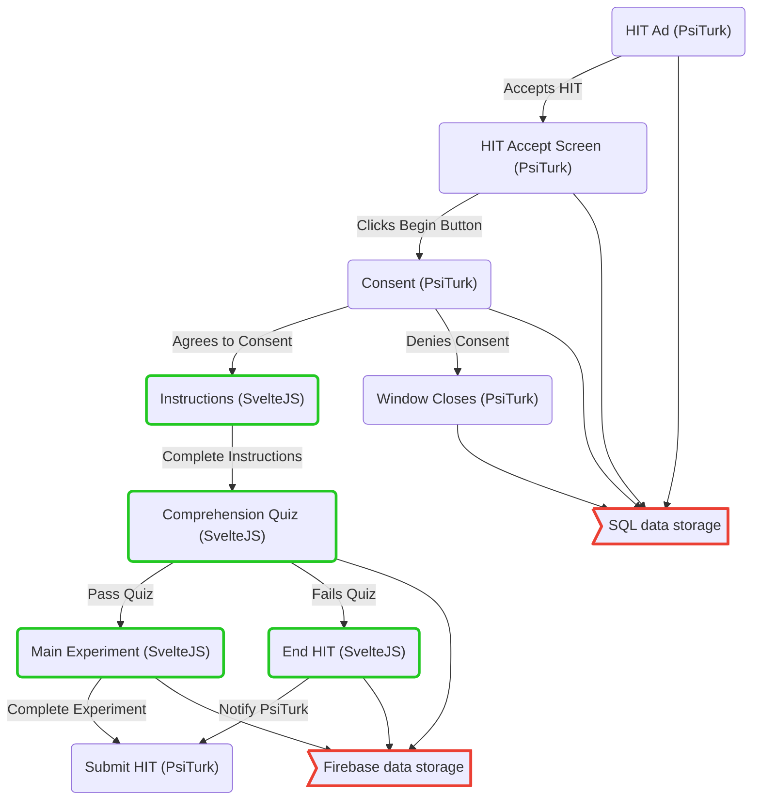

```mermaid
graph TD
n1("HIT Ad (PsiTurk)") -->|Accepts HIT| n2("HIT Accept Screen (PsiTurk)")
n2 -->|Clicks Begin Button| n3("Consent (PsiTurk)")
n3 -->|Agrees to Consent| n4("Instructions (SvelteJS)")
n3 -->|Denies Consent| n0("Window Closes (PsiTurk)")
n4 -->|Complete Instructions| n5("Comprehension Quiz (SvelteJS)")
n5 -->|Pass Quiz| n6("Main Experiment (SvelteJS)")
n6 -->|Complete Experiment| n01
n5 -->|Fails Quiz| n00("End HIT (SvelteJS)")
n00 -->|Notify PsiTurk| n01("Submit HIT (PsiTurk)")
n5 --> g>"Firebase data storage"]
n6 --> g
n00 --> g
n1 --> gg>"SQL data storage"]
n2 --> gg
n3 --> gg
n0 --> gg

classDef svelte stroke:#23c823,stroke-width:3px;
classDef data stroke:#eb4034,stroke-width:3px;
class n4,n5,n6,n00 svelte
class g,gg data
```